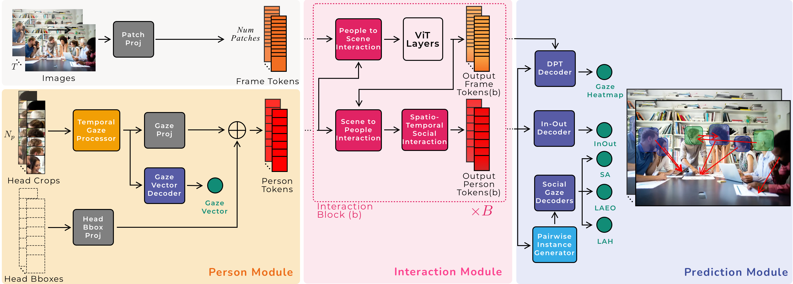

<!--
# SPDX-FileCopyrightText: Copyright 2025 Idiap Research Institute <contact@idiap.ch>
# SPDX-FileContributor: Anshul Gupta <anshul.gupta@idiap.ch>
# SPDX-License-Identifier: GPL-3.0-only

-->

### Overview

-----

**MTGS: A Novel Framework for Multi-Person Temporal Gaze Following and Social Gaze Prediction** <br>
*Anshul Gupta*, *Samy Tafasca*, *Arya Farkhondeh*, *Pierre Vuillecard*, *Jean-Marc Odobez* <br>
NeurIPS 2024 <br>
[\[Paper\]](https://proceedings.neurips.cc/paper_files/paper/2024/hash/1caf09c9f4e6b0150b06a07e77f2710c-Abstract-Conference.html) [\[Video\]](https://neurips.cc/virtual/2024/poster/96265) [\[Dataset\]](https://doi.org/10.34777/jggs-1128)

This repository provides the official code and checkpoints for the **MTGS model**, as introduced in our NeurIPS paper, *MTGS: A Novel Framework for Multi-Person Temporal Gaze Following and Social Gaze Prediction*.


### Model

-----

**MTGS** jointly models gaze following and social gaze prediction in multi-person scenarios. It leverages temporal information and interactions among individuals to enhance gaze prediction accuracy.



### Results

-----

We release an improved version of MTGS that uses a frozen DINOv2 encoder, providing significant gains over the original model and surpassing recent state-of-the-art methods.

Results on GazeFollow test set:

| Method                    | Resolution | AUC        | Avg. Dist. | Min. Dist. |
|---------------------------|------------|------------|------------|------------|
| Gaze-LLE [CVPR'25]        | 448x448    | **0.956**  | 0.104      | 0.045      |
| MTGS-static [NeurIPS'24]  | 224x224    | 0.929      | 0.116      | 0.059      |
| MTGS-DINO-static          | 224x224    | 0.944      | 0.101      | 0.045      |
| MTGS-DINO-static          | 448x448    | 0.949      | **0.098**  | **0.043**  |

Results on the VideoAttentionTarget test set:

| Method                        | Resolution | Dist.    | AP_IO     |
|-------------------------------|------------|----------|-----------|
| Gaze-LLE [CVPR'25]            | 448x448    | 0.107    | **0.897** |
| MTGS-static [NeurIPS'24]      | 224x224    | 0.114    | 0.843     |
| MTGS (temporal) [NeurIPS'24]  | 224x224    | 0.112    | 0.845     |
| MTGS-DINO-static              | 224x224    | 0.102    | 0.852     |
| MTGS-DINO-static              | 448x448    | **0.096**| 0.878     |
| MTGS-DINO (temporal)          | 448x448    | **0.096**| 0.888     |

Results on the VSGaze test set:

| Method                        | Resolution | Dist.     | AP_IO     | F1_LAH (PP) | F1_LAEO (PP) | AP_SA |
|-------------------------------|------------|-----------|-----------|-------------|---------------|-------|
| MTGS-static [NeurIPS'24]      | 224x224    | 0.108     | 0.946     | 0.806       | 0.599         | 0.555 |
| MTGS (temporal) [NeurIPS'24]  | 224x224    | 0.107     | 0.940     | 0.812       | 0.603         | 0.576 |
| MTGS-DINO-static              | 224x224    | 0.096     | 0.951     | 0.833       | 0.624         | 0.551 |
| MTGS-DINO-static              | 448x448    | 0.089     | 0.960     | 0.832       | 0.621         | 0.595 |
| MTGS-DINO (temporal)          | 448x448    | **0.087** | **0.961** | **0.837**   | **0.626**     | **0.596** |


If you use this updated version, please reference these improved results in your work.


### Setup

-----

#### Download Data

Follow the instructions on the [VSGaze dataset page](https://doi.org/10.34777/jggs-1128) to download and prepare the data.

After downloading, update the paths in `mtgs/config/config.yaml`:
* Set `ann_root` to the directory containing the annotation H5 files.
* Set `root` to the root path of the images for each dataset.


#### Setup Conda Environment

We use **PyTorch** for our experiments. 

Create a conda environment:
```bash
conda create -n mtgs-env python=3.8
conda activate mtgs-env
pip install -r requirements.txt
```

Then install the MTGS package. Go to the root directory and run:

```bash
pip install -e .
```

NOTE: All scripts are inside the `scripts` folder.


### Demo

-----

* Update `YOLO_CHECKPOINT_FILE` to point to the head detection model checkpoint (we use a [pre-trained YOLOv5 model](https://github.com/MahenderAutonomo/yolov5-crowdhuman) trained on the CrowdHuman dataset). <br>
* Also update `MTGS_CHECKPOINT_FILE` with the path to the [`mtgs-static-vsgaze` model](https://doi.org/10.34777/645b-xk74), and set the paths to `VIDEO_FILE` and `OUTPUT_FOLDER`.
```bash
bash demo.sh
```


### Training

-----

#### Train on GazeFollow

Update `GAZE_WEIGHTS` to point to the pre-trained [gaze backbone](https://doi.org/10.34777/bz8n-ps75):
```bash
bash train_gazefollow.sh
```

#### Train on VSGaze

Update `WEIGHTS` to point to the GazeFollow pre-trained checkpoint:

```bash
bash train_vsgaze.sh
```

This trains the temporal MTGS model. 

NOTE:

* You can also train on individual datasets in VSGaze by setting the `experiment.dataset` variable to `childplay`, `videocoatt`, `uco_laeo` or `vat`.
* Depending on batch size and dataset, you may need to update the `data.num_steps` variable to ensure a smooth learning rate schedule.


### Testing

-----

Update the `TEST_CHECKPOINT` path:

```bash
bash test_vat.sh
```

This performs evaluation on VideoAttentionTarget. To perform evaluation on a different dataset, set `DATASET` to one of `gazefollow`, `vsgaze`, `childplay`, `videocoatt`, `uco_laeo` or `vat`. 

We provide additional scripts for computing in-out, post-processing metrics under `mtgs/performance/`.


### Pre-trained Models

-----
Pre-trained models are available on [Huggingface](https://huggingface.co/collections/Idiap/mtgs).

| Model Name | Download Link | Description |
|------------|---------------|-------------|
| `mtgs-static-gazefollow` | [Link](https://doi.org/10.34777/f6zw-kj93) | MTGS model trained on GazeFollow without temporal modeling. |
| `mtgs-static-vsgaze` | [Link](https://doi.org/10.34777/645b-xk74) | MTGS model trained on VSGaze without temporal modeling. |
| `mtgs-vsgaze` | [Link](https://doi.org/10.34777/t9fd-cg21) | MTGS model trained on VSGaze with temporal modeling. |
| `resnet18-gaze360` | [Link](https://doi.org/10.34777/bz8n-ps75) | ResNet-18 trained on Gaze360, used for initializing the gaze backbone. |


### Citation

-----

If you use our code, please cite:

```bibtex
@article{gupta2024mtgs,
title={MTGS: A Novel Framework for Multi-Person Temporal Gaze Following and Social Gaze Prediction},
author={Gupta, Anshul and Tafasca, Samy and Farkhondeh, Arya and Vuillecard, Pierre and Odobez, Jean-Marc},
journal={Advances in Neural Information Processing Systems},
volume={37},
pages={15646--15673},
year={2024}
}
```

### References

-----

Parts of the code are adapted from the [ViT-Adapter](https://github.com/czczup/ViT-Adapter) codebase. The demo code uses a pre-trained [YOLOv5 based head detection model](https://github.com/MahenderAutonomo/yolov5-crowdhuman).

The code template was based on [Sharingan](https://github.com/idiap/sharingan).

We thank the authors for their contributions.


### License

-----

This code is released under the GPL-3.0-only license. See the [LICENSE](LICENSES/gpl-3-only.txt) file for more details. Please also see the [DEPENDENCIES](THIRD_PARTY/third_party.md) file for license information regarding third-party software used in this project.